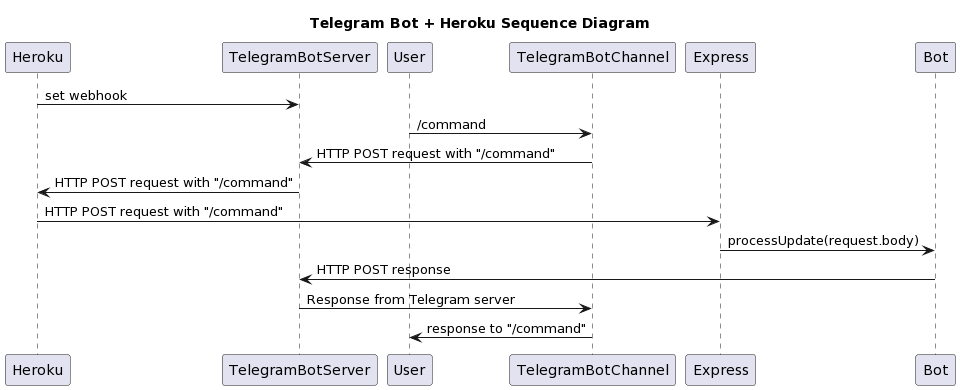

# npm packages used

"devDependencies": {
"eslint": "^8.39.0",
"eslint-config-prettier": "^8.8.0",
"eslint-config-standard": "^17.0.0",
"eslint-plugin-import": "^2.27.5",
"eslint-plugin-n": "^15.7.0",
"eslint-plugin-prettier": "^4.2.1",
"eslint-plugin-promise": "^6.1.1",
"husky": "^8.0.3",
"lint-staged": "^13.2.1",
"prettier": "^2.8.8"
},
"dependencies": {
"dotenv": "^16.0.3",
"express": "^4.18.2",
"node-telegram-bot-api": "^0.61.0"
}

@startuml
title Telegram Bot + Heroku Sequence Diagram

Heroku -> TelegramBotServer: set webhook
User -> TelegramBotChannel: /command
TelegramBotChannel -> TelegramBotServer: HTTP POST request with "/command"
TelegramBotServer -> Heroku: HTTP POST request with "/command"
Heroku -> Express: HTTP POST request with "/command"
Express -> Bot: processUpdate(request.body)
Bot -> TelegramBotServer: HTTP POST response
TelegramBotServer -> TelegramBotChannel: Response from Telegram server
TelegramBotChannel -> User: response to "/command"
@enduml

@startuml
title Telegram Bot + Heroku + HolidayAPI Sequence Diagram

Heroku -> TelegramBotServer: set webhook
User -> TelegramBotChannel: message
TelegramBotChannel -> TelegramBotServer: HTTP POST request with user message
TelegramBotServer -> Heroku: HTTP POST request with user message
Heroku -> Bot: HTTP POST request with user message
Heroku -> TelegramBotServer: acknowledge request
Bot -> HolidayApi: request holiday data
HolidayApi -> Bot: response with data
Bot -> TelegramBotServer: HTTP POST response
TelegramBotServer -> TelegramBotChannel: Response from Telegram server
TelegramBotChannel -> User: response to user message
@enduml
